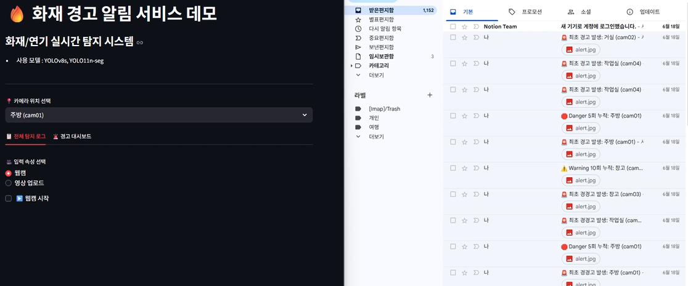
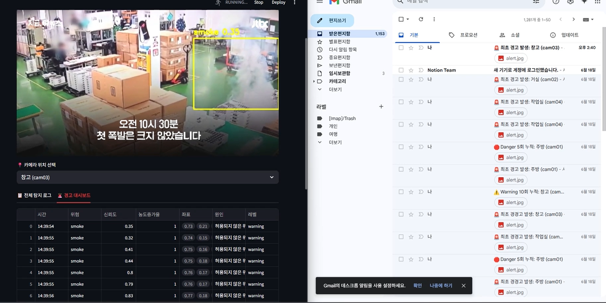
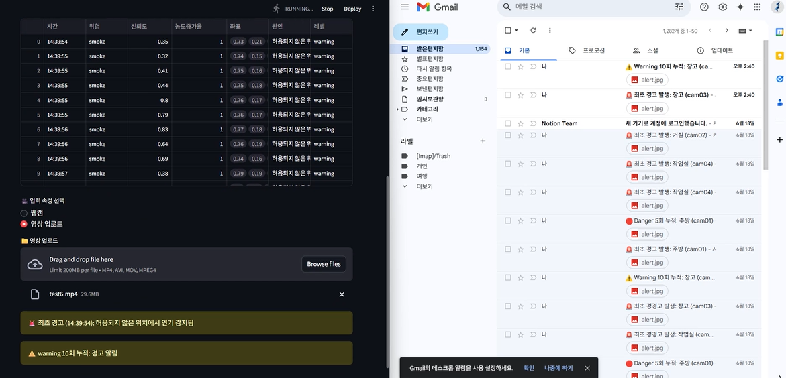
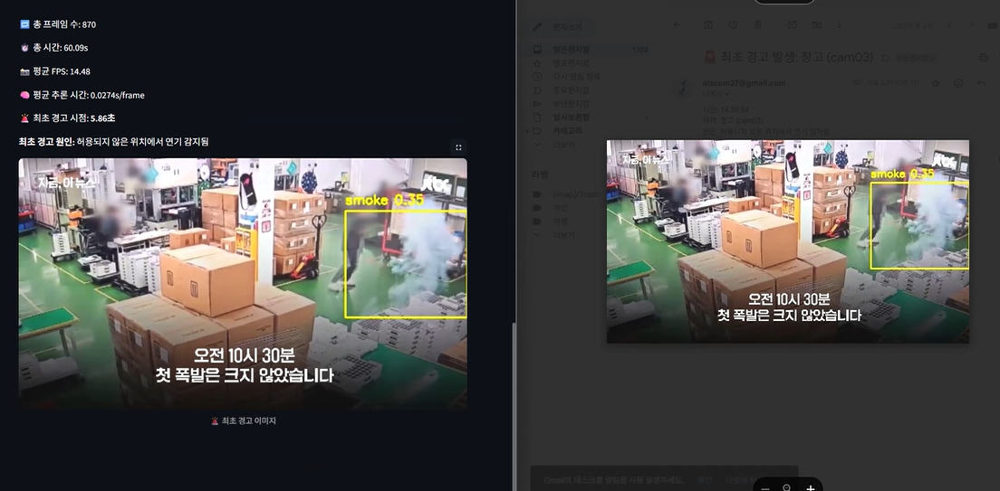

# 🔥 Firewatch-AI: 실시간 화재·연기 탐지 및 경고 시스템

YOLOv8 기반으로 화재 및 연기를 실시간 탐지하고, 경고 조건 판단 및 이메일 알림까지 제공하는 스마트 감시 시스템입니다.  
Streamlit을 기반으로 사용자 인터페이스를 구현하고, 다양한 위험 판단 로직과 시각화 기능을 통합했습니다.

## 🚨 주요 기능

- **실시간 영상 감지 (웹캠 / 영상 업로드 지원)**
- **YOLOv8s 모델로 화재·연기 Detection**
- **YOLO11n-seg 모델로 연기 확산 Segmentation**
- **객체 수, 면적 성장률, 농도 증가율 기반 위험 판단**
- **Streamlit 대시보드 UI 및 로그 테이블**
- **Gmail 연동 이메일 경고 (이미지 포함 첨부)**
- **모델 결과 앙상블 (WBF)**

## 🧠 프로젝트 배경

요식업, 미용실, 산업현장 등에서 화재 위험이 상존하며,  
기존의 연기/열 센서 기반 경보 시스템은 한계가 존재합니다.

> “불이 나는 영상에서는 연기의 농도가 점점 짙어진다”는 인사이트를 기반으로  
영상의 밝기 변화와 연기 확산 속성까지 고려한 지능형 경고 시스템을 개발하게 되었습니다. :contentReference[oaicite:0]{index=0}

## 👩‍💻 기술 스택

| 영역         | 사용 기술                        |
|--------------|----------------------------------|
| 언어/환경    | Python, Streamlit                |
| 모델         | Ultralytics YOLOv8s, YOLO11n-seg |
| 영상 처리    | OpenCV                           |
| 데이터 처리  | Numpy, Pandas                    |
| 후처리       | Ensemble Boxes (WBF)             |
| 알림 시스템  | Gmail SMTP + threading           |

## 🗂 데이터셋

- 🔸 `FireSmokeDetection-v3`: 화재/연기 객체 탐지용
- 🔸 `Fire and Smoke Segmentation v5`: 연기 마스크 학습용  
→ 모두 **Roboflow**에서 수집 및 증강 처리

## 📈 성능

| 항목                | YOLOv8s | YOLO11n-seg |
|---------------------|---------|-------------|
| mAP@0.5             | 96%     | 78% (Seg)   |
| Precision / Recall  | 96 / 92 | 79 / 57     |
| mAP@0.5:0.95        | 65%     | 51%         |

## 🔄 경고 로직 예시

- 🔥 화재 면적 증가율 > 3배 & 신뢰도 ≥ 0.7 → `danger`
- 💨 연기 객체 ≥ 3개 → 최초 경고
- 💨 평균 밝기 감소율 > 1.5 → 농도 기반 `danger` 분기
- 🚨 누적 경고 횟수에 따른 알림 제한 처리 (Streamlit 상태 활용)

## 📬 이메일 알림

- 위험 감지 시 자동 이메일 발송
- OpenCV 이미지 → JPEG 인코딩 후 첨부
- UI 멈춤 방지를 위한 `threading.Thread` 처리  
  → 빠른 반응성 유지

## 🎯 향후 계획

- RTSP 기반 **실시간 CCTV 스트리밍 연동**
- 누적 위험도 판단 로직 + 다단계 경고 강화
- **모바일 푸시 알림, 카카오톡 연동 등 채널 확장**
- 탐지 이력 기반 **시각화 대시보드** 구축
- 다양한 AI 모델 간 **협업 추론 구조** 적용

## 📚 참고 자료

- [Ultralytics YOLOv8 Docs](https://docs.ultralytics.com/)
- [Streamlit Documentation](https://docs.streamlit.io/)
- [OpenCV Image Processing](https://docs.opencv.org/)
- Gmail SMTP 연동 (Python)
- Roboflow Dataset (Fire/Smoke Detect & Segment)

## 📎 GitHub Repository

🔗 [https://github.com/alscom27/firewatch-ai](https://github.com/alscom27/firewatch-ai)

---

## ✅ 데모 실행 화면

---

## 🙋‍♂️ Q&A

본 프로젝트는 개인 실험 및 학습을 목적으로 진행되었으며,  
실제 화재 감지 시스템으로 사용하기 전에 **철저한 검증 및 고도화**가 필요합니다.
